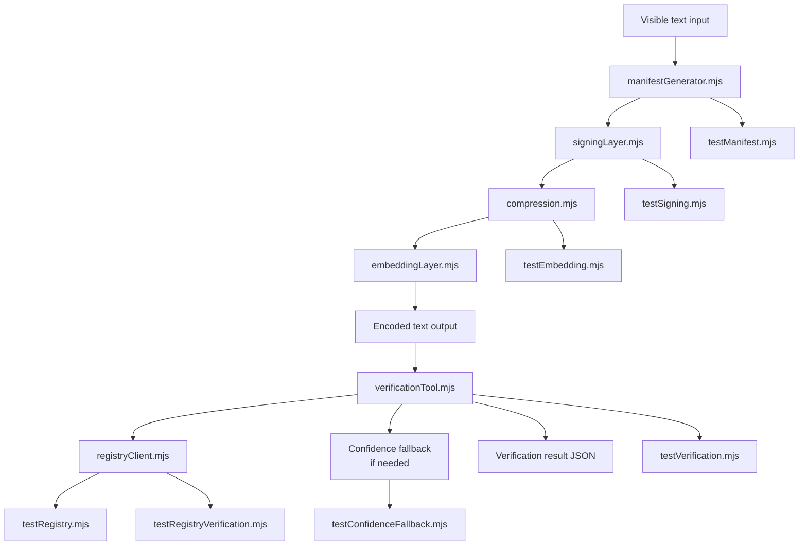
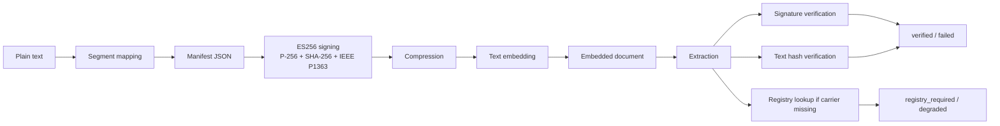
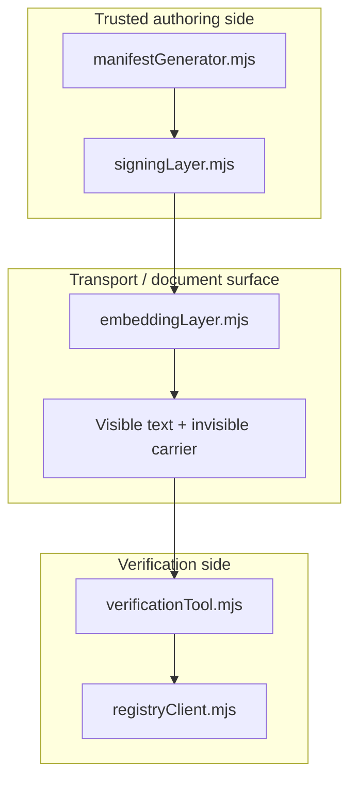
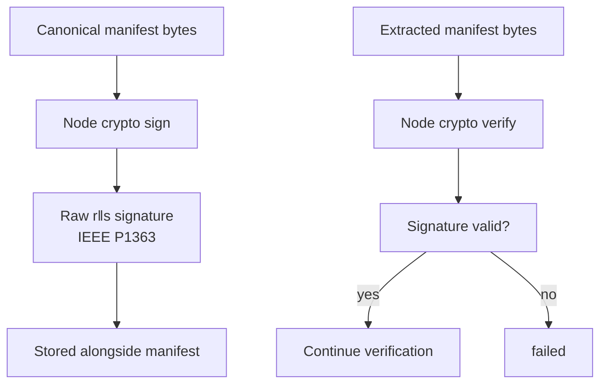
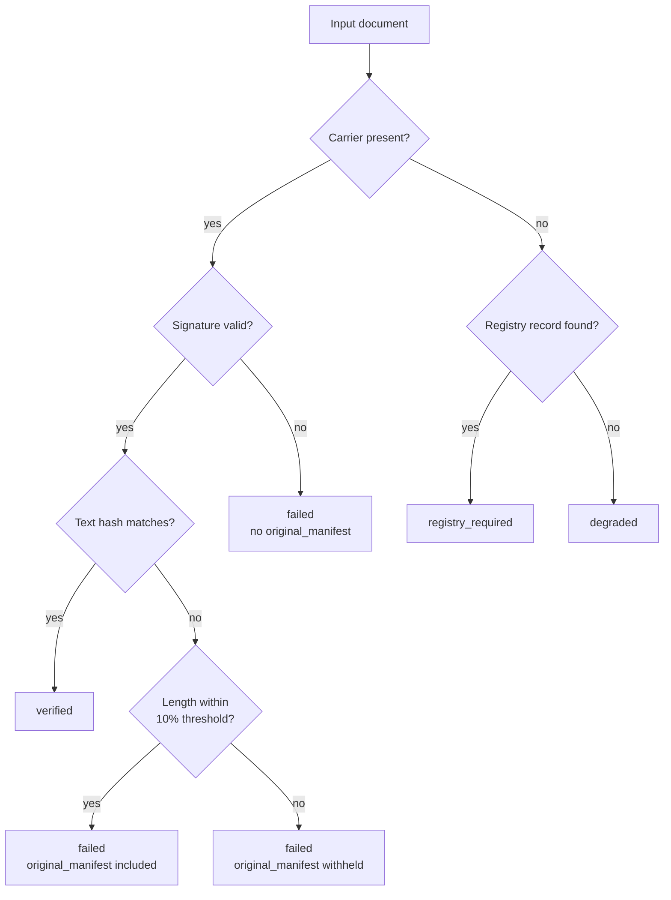
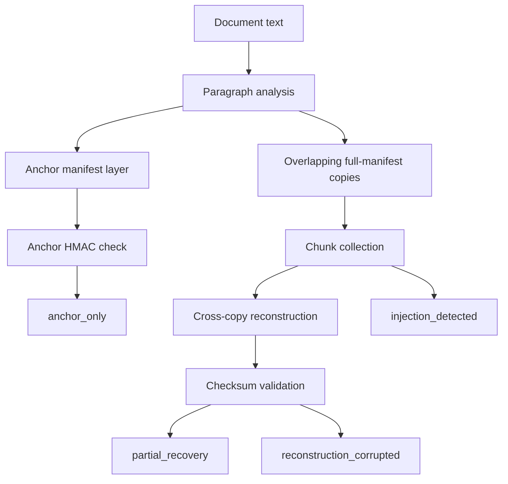
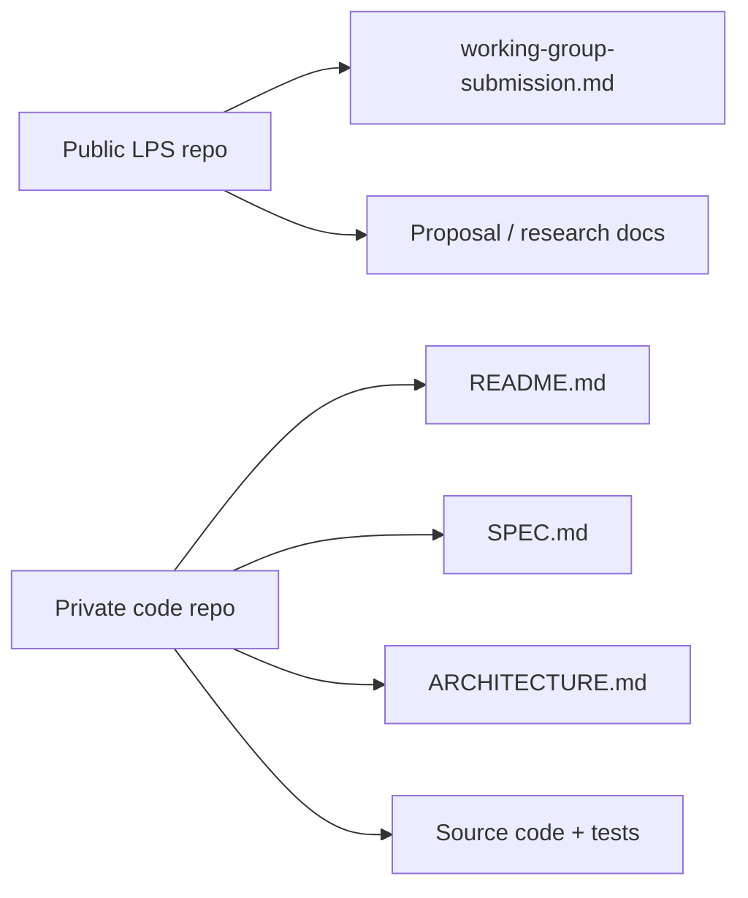

# LPS Diagrams

This file is the visual companion to `ARCHITECTURE.md` and the private `SPEC.md`. It separates the built v0.1 pipeline from future Proposal 005 work.

## 1 Current v0.1 component tree

## 2 Current v0.1 data flow

## 3 Trust boundaries

## 4 Signing and verification boundary

## 5 Verification outcome model for v0.1

Note: the length-threshold branch (J/K/L) reflects the D.6
disclosure-threshold decision, locked and implemented July 3 2026.
A manifest missing `text_length` (a pre-D.6 legacy case, not
currently producible by this codebase) also routes to `failed`
with no disclosure — omitted here to keep the diagram readable;
see `verificationTool.mjs` STEP 4 for the exact three-way branch.

## 6 Future Proposal 005 flow

## 7 Repository split

## 8 One-line summary

- Public repo explains what LPS is.
- Private repo explains how the reference implementation works.
- v0.1 is built.
- Proposal 005 is specified but not yet built.
