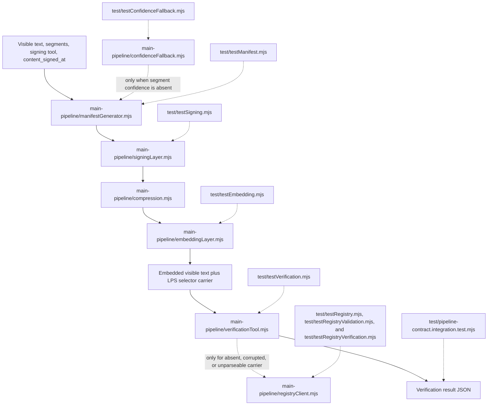
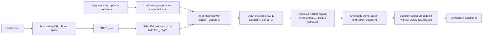
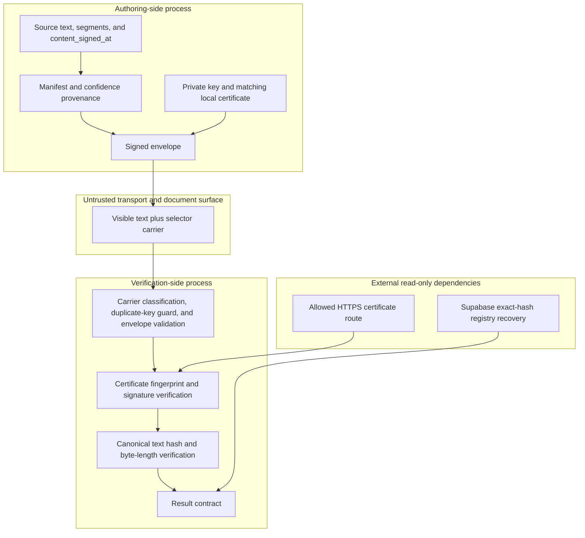
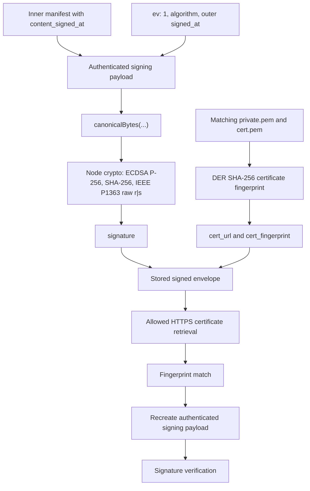
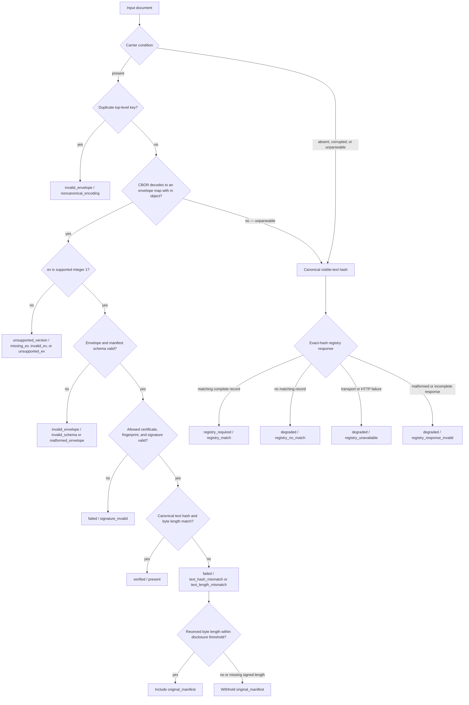
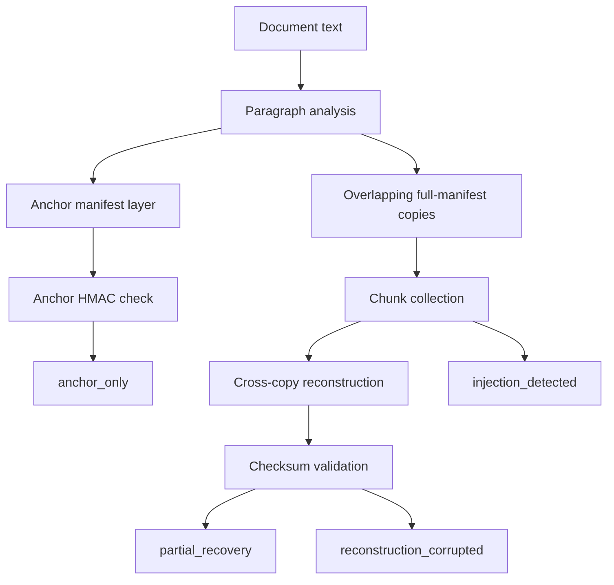
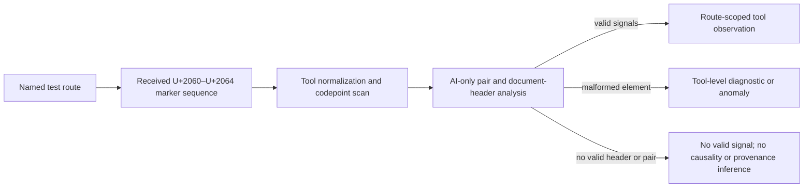
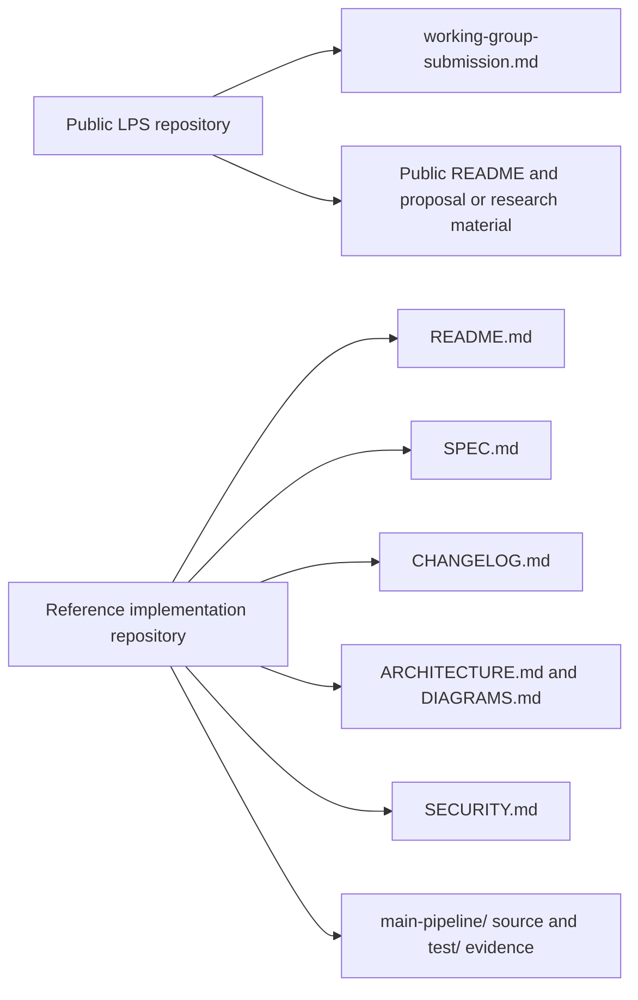

# LPS Diagrams

This file is the visual companion to `ARCHITECTURE.md` and `SPEC.md`. It
describes the current audited v0.1 reference pipeline only. It does not claim
production readiness, C2PA conformance, or implementation of Proposal 005.

## 1. Current v0.1 component tree

```mermaid
flowchart TD
    A["Visible text, segments, signing tool, content_signed_at"] --> B["main-pipeline/manifestGenerator.mjs"]
    F["main-pipeline/confidenceFallback.mjs"] -. "only when segment confidence is absent" .-> B
    B --> C["main-pipeline/signingLayer.mjs"]
    C --> D["main-pipeline/compression.mjs"]
    D --> E["main-pipeline/embeddingLayer.mjs"]
    E --> G["Embedded visible text plus LPS selector carrier"]

    G --> H["main-pipeline/verificationTool.mjs"]
    H -. "only for absent, corrupted, or unparseable carrier" .-> I["main-pipeline/registryClient.mjs"]
    H --> J["Verification result JSON"]

    K["test/testManifest.mjs"] -.-> B
    L["test/testConfidenceFallback.mjs"] -.-> F
    M["test/testSigning.mjs"] -.-> C
    N["test/testEmbedding.mjs"] -.-> E
    O["test/testVerification.mjs"] -.-> H
    P["test/testRegistry.mjs, test/testRegistryValidation.mjs, and test/testRegistryVerification.mjs"] -.-> I
    Q["test/pipeline-contract.integration.test.mjs"] -.-> J
```

The dotted test links are evidence links, not runtime data paths.

## 2. Current v0.1 authoring and transport flow

```mermaid
flowchart LR
    A["Visible text"] --> B["Strip trailing CR, LF, and space"]
    B --> C["UTF-8 bytes"]
    C --> D["SHA-256 text_hash and byte text_length"]

    E["Segments and optional confidence"] --> F["Confidence provenance: tool or fallback"]
    F --> G["Inner manifest with content_signed_at"]
    D --> G

    G --> H["Outer envelope: ev: 1, algorithm, signed_at"]
    H --> I["Canonical CBOR signing bytes and IEEE P1363 signature"]
    I --> J["Shortcode compression and CBOR encoding"]
    J --> K["Selector-carrier embedding without visible-text change"]
    K --> L["Embedded document"]
```

`ev` remains a direct outer-envelope field through compression; it is not a
shortcode dictionary entry. The selector carrier is an LPS format and is not a
C2PA JUMBF/COSE manifest store.

## 3. Trust and validation boundaries

```mermaid
flowchart TD
    subgraph A["Authoring-side process"]
        A1["Source text, segments, and content_signed_at"]
        A2["Manifest and confidence provenance"]
        A3["Private key and matching local certificate"]
        A4["Signed envelope"]
        A1 --> A2 --> A4
        A3 --> A4
    end

    subgraph B["Untrusted transport and document surface"]
        B1["Visible text plus selector carrier"]
    end

    subgraph C["Verification-side process"]
        C1["Carrier classification, duplicate-key guard, and envelope validation"]
        C2["Certificate fingerprint and signature verification"]
        C3["Canonical text hash and byte-length verification"]
        C4["Result contract"]
        C1 --> C2 --> C3 --> C4
    end

    subgraph D["External read-only dependencies"]
        D1["Allowed HTTPS certificate route"]
        D2["Supabase exact-hash registry recovery"]
    end

    A4 --> B1 --> C1
    D1 --> C2
    D2 --> C4
```

The verifier treats the visible text, carrier, decoded envelope, certificate
response, and registry response as untrusted until their applicable validation
boundary completes. The registry is consulted only on the recovery branch and
does not authenticate an issuer or restore segment evidence.

## 4. Signed-envelope and certificate boundary

```mermaid
flowchart TD
    A["Inner manifest with content_signed_at"] --> C["Authenticated signing payload"]
    B["ev: 1, algorithm, outer signed_at"] --> C
    C --> D["canonicalBytes(...)"]
    D --> E["Node crypto: ECDSA P-256, SHA-256, IEEE P1363 raw r|s"]
    E --> F["signature"]

    G["Matching private.pem and cert.pem"] --> H["DER SHA-256 certificate fingerprint"]
    H --> I["cert_url and cert_fingerprint"]
    F --> J["Stored signed envelope"]
    I --> J

    J --> K["Allowed HTTPS certificate retrieval"]
    K --> L["Fingerprint match"]
    L --> M["Recreate authenticated signing payload"]
    M --> N["Signature verification"]
```

The authenticated signing payload is `ev`, `manifest`, `algorithm`, and outer
`signed_at`. The verifier validates envelope structure and version before
certificate retrieval; an inner `signed_at` is invalid.

## 5. Verification outcome model for v0.1

```mermaid
flowchart TD
    A["Input document"] --> B{"Carrier condition"}

    B -->|"present"| C{"Duplicate top-level key?"}
    C -->|"yes"| D["invalid_envelope / noncanonical_encoding"]
    C -->|"no"| E{"CBOR decodes to an envelope map with m object?"}
    E -->|"no — unparseable"| P["Canonical visible-text hash"]
    E -->|"yes"| F{"ev is supported integer 1?"}
    F -->|"no"| G["unsupported_version / missing_ev, invalid_ev, or unsupported_ev"]
    F -->|"yes"| H{"Envelope and manifest schema valid?"}
    H -->|"no"| I["invalid_envelope / invalid_schema or malformed_envelope"]
    H -->|"yes"| J{"Allowed certificate, fingerprint, and signature valid?"}
    J -->|"no"| K["failed / signature_invalid"]
    J -->|"yes"| L{"Canonical text hash and byte length match?"}
    L -->|"yes"| M["verified / present"]
    L -->|"no"| N["failed / text_hash_mismatch or text_length_mismatch"]
    N --> O{"Received byte length within disclosure threshold?"}
    O -->|"yes"| Q["Include original_manifest"]
    O -->|"no or missing signed length"| R["Withhold original_manifest"]

    B -->|"absent, corrupted, or unparseable"| P
    P --> S{"Exact-hash registry response"}
    S -->|"matching complete record"| T["registry_required / registry_match"]
    S -->|"no matching record"| U["degraded / registry_no_match"]
    S -->|"transport or HTTP failure"| V["degraded / registry_unavailable"]
    S -->|"malformed or incomplete response"| W["degraded / registry_response_invalid"]
```

Duplicate top-level envelope keys fail before version routing, certificate
retrieval, registry access, or fallback. An `invalid_envelope` is not eligible
for registry recovery. Disclosure affects only inclusion of `original_manifest`;
it never changes the verification status or reason code.

## 6. Deferred Proposal 005 concept — not implemented

```mermaid
flowchart TD
    A["Document text"] --> B["Paragraph analysis"]
    B --> C["Anchor manifest layer"]
    B --> D["Overlapping full-manifest copies"]

    C --> E["Anchor HMAC check"]
    D --> F["Chunk collection"]
    F --> G["Cross-copy reconstruction"]
    G --> H["Checksum validation"]
    E --> I["anchor_only"]
    H --> J["partial_recovery"]
    F --> K["injection_detected"]
    H --> L["reconstruction_corrupted"]
```

This is proposal-only research deferred pending working-group feedback. It
does not define an active fallback, carrier, verifier, or interoperability
contract for v0.1.

## 7. Separate Proposal 007 testing-tool boundary [NON-NORMATIVE]

```mermaid
flowchart LR
    A["Named test route"] --> B["Received U+2060–U+2064 marker sequence"]
    B --> C["Tool normalization and codepoint scan"]
    C --> D["AI-only pair and document-header analysis"]
    D -->|"valid signals"| E["Route-scoped tool observation"]
    D -->|"malformed element"| F["Tool-level diagnostic or anomaly"]
    D -->|"no valid header or pair"| G["No valid signal; no causality or provenance inference"]
```

It records the proposed marker/header design; it records observations
from named routes. This flow has no edge to the v0.1 LPS signer, carrier,
registry, or verifier. A reported marker-survival result describes the
received sequence for that test route only, not a general transport or
provenance conclusion.

## 8. Repository split

```mermaid
flowchart LR
    A["Public LPS repository"] --> B["working-group-submission.md"]
    A --> C["Public README and proposal or research material"]

    D["Reference implementation repository"] --> E["README.md"]
    D --> F["SPEC.md"]
    D --> G["CHANGELOG.md"]
    D --> H["ARCHITECTURE.md and DIAGRAMS.md"]
    D --> I["SECURITY.md"]
    D --> J["main-pipeline/ source and test/ evidence"]
```

## 9. Current-state summary

- The v0.1 audited reference pipeline creates, signs, compresses, embeds, and
  verifies LPS selector carriers.
- Valid-carrier verification authenticates the envelope and both canonical
  visible-text bindings; recovery is limited to exact-hash registry evidence
  after an unavailable or unparseable carrier.
- The implementation evidence does not establish production credential policy,
  issuer trust, registry operations, universal transport survival, or C2PA,
  COSE, or JOSE conformance.
- Proposal 005 remains deferred and unimplemented.
- Proposal 007 remains a separate testing-tool design and observation record.
